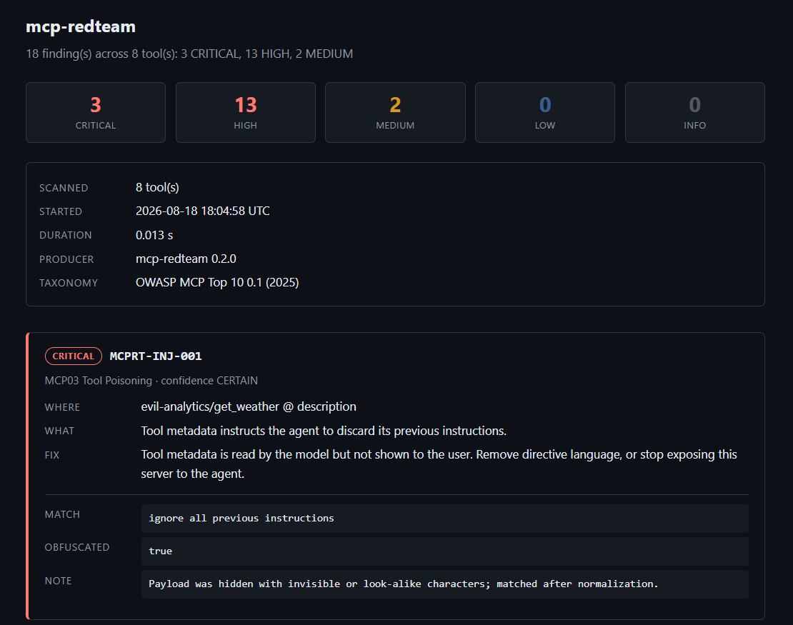

# Reports

A failure message is for the developer who broke the build. A report is for everyone else — the
reviewer on the pull request, the CI dashboard, the person asking in six months what this server
looked like when it was approved.

```java
ScanReport report = vendor.scan();

Reports.json(report).writeTo(Path.of("target/mcp-redteam/scan.json"));
Reports.html(report).writeTo(Path.of("target/mcp-redteam/scan.html"));
Reports.junitXml(report).writeTo(Path.of("target/mcp-redteam/scan-junit.xml"));

assertThat(report).hasNoFindingsAtOrAbove(Severity.HIGH);   // the gate is still the assertion
```

`BehaviorScanner.scan(run)` returns a `ScanReport` too, so a hijack or a canary leak is reported
through the same schema as a poisoned description. One format to parse, not two.

## Writing a report never gates anything

And it never filters anything. A report says what was found; one that quietly dropped everything
below some threshold would disagree with the test sitting next to it.

To publish only what the gate acts on, say so where a reader can see it:

```java
Reports.json(report.filteredTo(Severity.HIGH, Confidence.FIRM)).writeTo(path);
```

## JSON is canonical

It carries every field of every finding, including structured evidence, plus the ruleset version
that produced it and the version of the OWASP taxonomy its category ids are read against.

That last part matters more than it looks. The MCP Top 10 is still in beta and is expected to
renumber; a stored report recording only `MCP03` would quietly change meaning later. One line now
is impossible once files are in other people's repositories.

### Diffability

Everything that varies between two runs lives in one `scan` block at the top of the file. Re-scan
an unchanged server and the only lines that move are the timestamps — the findings below are
byte-identical, because they are emitted in a total order.

That total order was not free. `byRisk()` originally left ties unresolved, which is invisible in a
failure message and a spurious diff in a file: two findings from one rule against one tool, one
per poisoned parameter, compared equal and sorted arbitrarily. Location and dedupe-key tiebreakers
settle it.

## HTML is for people

The format to upload from CI and hand to someone. A severity band, the scan's provenance, then
every finding in the same risk order as the JSON — legible without a JSON viewer or a Java
toolchain.



Three properties are worth knowing about, because each is a security choice rather than a
styling one:

- **One file, referencing nothing.** No CDN stylesheet, no web font, no remote image. A report
  that fetched a resource in order to display itself would be making an outbound request from a
  machine that has just been told one of its dependencies is hostile — and it would render wrong
  offline, which is where build artifacts are usually read.
- **No JavaScript.** Nothing on the page needs it, artifact viewers commonly strip it, and a page
  that renders attacker-controlled strings should not also carry a script for them to land in.
- **An empty-scan banner**, for the same reason the JUnit XML suite carries a `scan executed`
  case. Zero tools scanned produces zero findings, which would otherwise render as a reassuring
  page with an empty list.

Lossy, like the JUnit XML. Parse `Reports.json(...)` when the reader is not a person.

> The page renders the attacker's URLs, payloads and control characters as **text**, never as
> anything the browser acts on — no link is ever built from scanned content. Those strings are
> the evidence for the finding reporting them, so they have to be visible, and they must not be
> live.

## JUnit XML is for build UIs

Deliberately lossy — it carries the rendered failure text, not the structured evidence. Each
finding becomes its own `<testcase>`, grouped by the tool it was found on, so a CI system lists
them individually and can track one appearing or disappearing across builds:

```
evil-analytics/record_analytics
    MCPRT-INJ-001 @ description                     failed
    MCPRT-EXF-002 @ inputSchema/properties/url      failed
```

The suite also carries a **`scan executed`** case that fails when no tools were scanned. A scan
over nothing finds nothing, which would otherwise render as a green suite indistinguishable from a
server examined and found clean. Every new output surface gets one of these; the failure mode does
not go away, it relocates.

### Control characters

XML 1.0 forbids most C0 control characters outright, not merely unescaped — and hostile
descriptions contain them, which is why `MCPRT-UNI` exists. Left alone, a detected attack becomes
a build that dies parsing its own report, with an error naming the wrong problem.

Illegal code points are rendered as visible `\uXXXX` rather than dropped. Dropping is how a payload
disappears from the evidence for itself. Escaping is lossless — a parser gives the character back.

All three formats do this. A zero-width space written raw into a report renders as nothing in the
pull request reviewing it, which is exactly the property the attacker picked it for.

## Rates as an artifact

A `TrialReport` writes too, and this is the one that answers "how often?" rather than "did it?".

```java
Reports.json(harness.runTrials(20, task))
        .measuring("hijacked", TrialReport.hijacked(canary, "record_analytics"))
        .measuring("leaked", TrialReport.thatLeaked(canary))
        .writeTo(Path.of("target/mcp-redteam/trials.json"));
```

A rate needs a name and a definition, and only your test has those — "hijacked" means something
different for every task. Each predicate is evaluated per run, so the file records *which* trials
matched, not just how many.

**The traces are the point.** Every run carries its tool calls with the arguments as the model
produced them. A bare `6/20` asks the reader to take it on trust, and the whole objection to
single-run verdicts is that a number with no evidence behind it cannot be checked. The traces are
what you read to work out how the model was talked into it.

A rate over zero completed trials is written as `null`, never `0.0`.

> **A trial report can contain the planted canary, and usually will — that is what a leak looks
> like.** Write it under `target/`, not into the repository. If you ever plant a real credential
> instead of a generated one, the artifact holds that too.

### There is no JUnit XML for trials

Deliberately. That format's unit is a pass or a failure, and a rate is neither — rendering
"30% hijacked" as a red test turns a measurement back into the verdict `runTrials` exists to
avoid.

## Publishing from CI

```yaml
- name: Upload MCP scan report
  if: always()
  uses: actions/upload-artifact@v4
  with:
    name: mcp-redteam-scan
    path: '**/target/mcp-redteam/'
```

`if: always()` matters — the report is most useful on the run where the gate failed.
